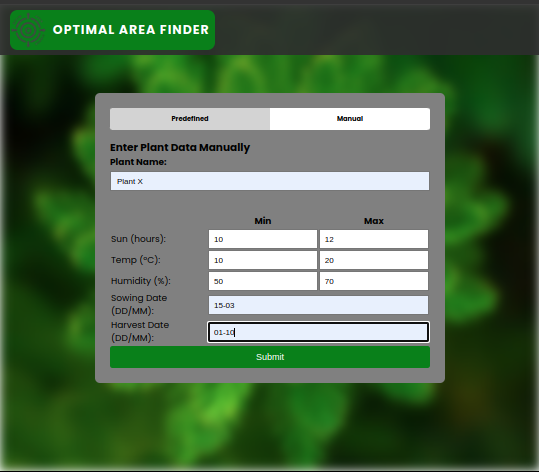
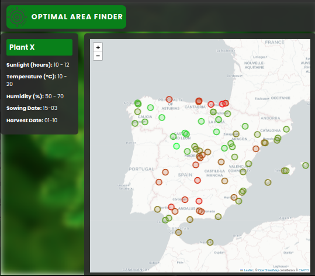

# 🌱 OAF: Optimal Area Finder

**OAF (Optimal Area Finder)** is an application designed to help farmers and gardeners identify the best locations in Spain to cultivate a specific plant. Based on data from meteorological stations, the application provides a visualization of expected growth performance across various areas, making agricultural planning more accurate and efficient.




## Table of Contents

- [🌱 OAF: Optimal Area Finder](#-oaf-optimal-area-finder)
  - [Table of Contents](#table-of-contents)
  - [Introduction](#introduction)
  - [Background](#background)
  - [Current Features](#current-features)
  - [Technologies Used](#technologies-used)
  - [Future Plans](#future-plans)
  - [Getting Started](#getting-started)

## Introduction

OAF is a simulation tool that calculates the potential daily growth of a plant based on ideal climatic conditions and defined cultivation dates. The app displays a color-coded map indicating which areas in Spain offer the most optimal conditions for plant growth, assisting in agricultural decision-making.

> *Note:* Growth calculations in this version of the app are not based on rigorous science but use limited polynomial functions for simplicity. In future versions, if there is interest, more precise methods will be developed that consider a wider variety of environmental factors and biological variables.

## Background

The app addresses the need to evaluate the feasibility of growing a specific plant in different locations based on climate data. Using historical data from 88 Spanish meteorological stations, the app simulates a plant's daily growth by considering factors like sunlight, temperature, and humidity. This allows farmers to pinpoint areas that offer optimal growth conditions for their crops.

## Current Features

- **Plant Selection and Parameters**:
  - **Predefined Plants**: Choose from common plants with ideal ranges of temperature, humidity, and sunlight hours.
  - **Manual Input**: Customize settings for any plant, including sowing and harvest dates.

- **Daily Growth Simulation**: The app uses daily data to calculate potential growth from sowing to harvest for each station.

- **Interactive Map**:
  - **Color-Coding**: Each meteorological station is displayed on the map with a color reflecting growth "optimality," from red (less optimal) to green (highly optimal).
  - **Station Details**: Click on a station to view specific growth data for that location.

## Technologies Used

- **Python 3.12**
- **Django**: Web framework that structures the app's backend.
- **Pandas**: Data manipulation and analysis.
- **Folium**: Creation of interactive maps.
- **HTML & CSS**: Frontend development.
- **Bootstrap**: Responsive and stylized interface design.


## Future Plans

In future versions, the application will include additional features such as:

- **Refined Growth Calculations**: Development of more precise simulation functions that integrate a wider variety of environmental and biological variables.
- **In-Map Growth Details**: Ability to view specific growth data in each area by clicking on the map points.
- **Report Export**: Generation of reports in PDF or Excel formats with recommendations and detailed optimization data.

## Getting Started

To run the application locally, follow these steps:

1. **Install the dependencies**

   Ensure that the dependencies listed in `requirements.txt` are installed by running:

   ```bash
   pip install -r requirements.txt
   ```

2. **Run the application**

   In your terminal, navigate to the project directory and run:

   ```bash
   python manage.py runserver
   ```

3. **Access the application**

   Open your web browser and go to:

   ```
   http://localhost:8000/
   ```

4. **Explore Cultivation Optimality**

   Select a predefined plant or manually input your parameters to view the optimality map for cultivation across Spain.

